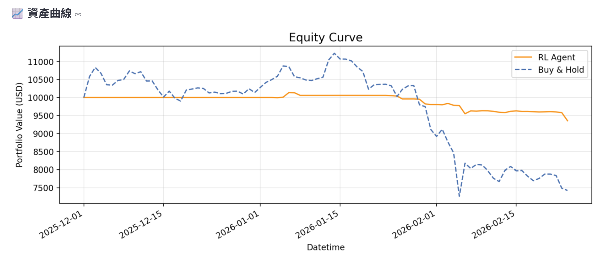
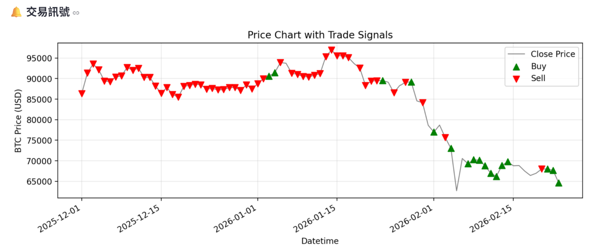
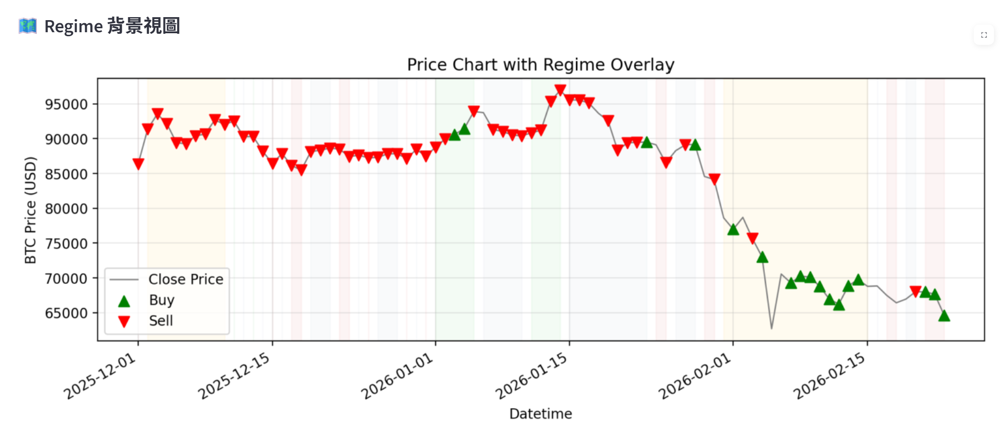

# Bitcoin RL Trading with PPO (Realism Enhanced)

本專案是「比特幣 + 強化學習（PPO）」的完整交易研究系統，重點不是只有訓練出訊號，而是盡可能把回測流程拉近真實市場。

你可以把它當作：

1. 可互動的課程專題展示系統（Streamlit）
2. 可重現的研究腳本（Python）
3. 具備現實交易約束的 RL 回測環境（Gymnasium）

## 核心亮點

1. RL 主體使用 Stable-Baselines3 的 PPO
2. 交易環境含現實約束：滑價、價差、最小下單限制、精度步進
3. 風險引擎：最大回撤停機、虧損停機、波動目標縮放
4. Regime-aware 決策：市場狀態標籤 + 不同門檻策略
5. 成本壓力測試：費率 / 滑價 / 價差情境比較
6. Walk-forward 滾動回測（可選）
7. 交易執行日誌（可檢視 maker/taker 成交結構）
8. 速度優化：快速模式、模型重用、資料與特徵快取

## 一頁式 Demo（30 秒看懂）

如果你是老師或評審，建議直接看這 5 點：

1. 問題：做一個「可互動、可回測、含現實交易成本」的 BTC 強化學習系統。
2. 方法：PPO + 技術指標特徵 + Regime-aware 門檻策略。
3. 現實性：加入滑價、價差、maker/taker 費率、最小下單規則、風險停機線。
4. 驗證：除了單次測試，還有成本壓力測試與 Walk-forward 滾動回測。
5. 可用性：Streamlit 有自動模式（保守/平衡/積極），非技術使用者可直接操作。

### Demo 快速操作

1. 開啟介面：`python -m streamlit run app_btc.py`
2. 使用自動模式，選「平衡」，按下「開始下載 & 訓練」
3. 看 4 個區塊：績效指標、下一根訊號、成本壓力測試、交易執行日誌
4. 若要快：選快速模式 + 載入既有模型

### 建議展示話術（答辯可直接用）

1. 這不是只有訊號圖，而是含交易成本與風險控制的執行層回測。
2. 模型在不同市場狀態使用不同門檻，不是單一規則硬套全部時段。
3. 我們額外做成本壓力測試與 Walk-forward，降低單次回測偏誤。

## 專案結構

```text
.
├── assets/
│   └── screenshots/
├── app_btc.py
├── btc_rl_trading_ppo.py
├── report.md
├── requirements.txt
└── README.md
```

檔案用途：

1. app_btc.py：Streamlit 互動介面（訓練、推論、視覺化、壓力測試、Walk-forward）
2. btc_rl_trading_ppo.py：核心環境與訓練流程（特徵工程、交易環境、評估）
3. report.md：課程報告內容
4. requirements.txt：部署與安裝依賴

## 成果截圖區塊

以下為目前專案已放入的 3 張成果圖：

### 1) 資產曲線（RL vs Buy & Hold）


### 2) 交易訊號（Buy/Sell）


### 3) Regime 背景視圖


## 系統流程

1. 載入資料（yfinance 或 CSV）
2. 特徵工程（13 個技術指標）
3. 市場 Regime 標記
4. 切分訓練/測試資料
5. 建立現實化交易環境（含成本與風險）
6. 訓練 PPO 或載入已訓練模型
7. 測試評估與視覺化
8. 可選執行成本壓力測試、Walk-forward

## 特徵工程

使用 13 個特徵：

1. return_1
2. ma_5
3. ma_10
4. ma_20
5. volatility_10
6. rsi_14
7. macd
8. macd_signal
9. macd_hist
10. close_over_ma5
11. close_over_ma10
12. close_over_ma20
13. vol_ratio

特徵會做標準化，再與代理人狀態（持倉比例、資金比例、淨值比例）合併成 observation。

## 交易環境（現實化版本）

目前環境不是教學版全倉切換，而是加入更接近實盤的執行限制：

### 動作定義

1. 0 = Hold
2. 1 = 增加倉位（按 position_step）
3. 2 = 減少倉位（按 position_step）

### 成本與成交模型

1. 基礎手續費 trade_fee
2. Maker/Taker 費率 maker_fee / taker_fee
3. 滑價 slippage_bps（可隨波動放大）
4. 價差 spread_bps
5. 最小成交比例 min_trade_pct
6. 最小名目金額 min_notional
7. 最小下單量 min_qty
8. 數量精度步進 qty_step
9. 價格精度步進 price_step

### 風險引擎

1. 最大回撤停機 max_drawdown_limit
2. 單次回測虧損停機 daily_loss_limit
3. 波動目標倉位縮放 volatility_target

### Reward（風險感知）

reward 由以下組成：

1. 投組變化報酬
2. 回撤懲罰
3. 成交量（turnover）懲罰
4. 風險停機懲罰

這讓模型不只是追求報酬，也會控制風險與過度交易。

## Regime-aware 策略

系統會根據均線、報酬、波動將市場分成：

1. bull_trend（多頭趨勢）
2. bear_trend（空頭趨勢）
3. range_bound（盤整震盪）
4. high_volatility（高波動）

下一根 K 棒訊號會依 Regime 套不同買賣門檻，並顯示：

1. 原始 PPO 動作
2. 門檻過濾後建議
3. Buy/Sell 機率與信心分數

## 介面功能（Streamlit）

### 使用者模式

1. 自動模式（預設）：
	- 一鍵選擇 保守 / 平衡 / 積極
	- 進階參數隱藏，適合快速使用
2. 進階模式：
	- 展開所有交易與風險參數
	- 可跑 Walk-forward 與研究測試

### 主要視覺化

1. 測試集績效指標（報酬、Sharpe、回撤、最終資產）
2. 資產曲線（RL vs Buy & Hold）
3. 交易訊號圖（歷史時間軸）
4. Regime 背景視圖
5. 動作分佈
6. 成本壓力測試表與圖
7. 交易執行日誌（含 execution/cost_rate）
8. 可選 Walk-forward 每折結果與平均摘要

## 速度優化設計

為了改善雲端等待時間，系統內建：

1. 快速模式 / 完整模式
2. 優先載入既有模型（跳過訓練）
3. yfinance 資料快取（cache）
4. 技術指標快取（cache）
5. 快速模式資料筆數上限
6. 快速模式自動略過重任務（如 Walk-forward）

## 安裝

建議使用虛擬環境。

### Windows

```powershell
python -m venv .venv
.venv\Scripts\activate
pip install -r requirements.txt
```

### macOS / Linux

```bash
python3 -m venv .venv
source .venv/bin/activate
pip install -r requirements.txt
```

## 執行方式

### 1) 啟動互動介面（推薦）

```powershell
python -m streamlit run app_btc.py
```

### 2) 執行腳本版

```powershell
python btc_rl_trading_ppo.py
```

## 資料格式

CSV 至少需要欄位：

```text
Datetime, Open, High, Low, Close, Volume
```

常見欄位別名（datetime/date/timestamp）會自動轉換。

## 評估指標

系統目前提供：

1. Cumulative Return
2. Sharpe Ratio
3. Max Drawdown
4. Sortino Ratio
5. Calmar Ratio
6. Trade Count / Trade Density
7. Cost Stress Test 情境比較

## Streamlit Cloud 部署

1. 將專案推到 GitHub
2. 在 Streamlit Cloud 連接 repo
3. 主程式設定為 app_btc.py
4. 確保 requirements.txt 在 repo root
5. 若首次部署較慢，可先使用快速模式驗證功能

## 實務限制與風險聲明

即使此版本已加入許多現實因素，仍與真實交易存在差距：

1. 未接入真實交易所撮合簿深度
2. 未模擬網路延遲與 API 失敗重送
3. 未含資金費率（永續合約）與借貸成本
4. 回測不代表未來績效

本專案僅供教學、研究與專題展示，不構成投資建議。

## 建議下一步

若要從研究走向準實盤，可優先做：

1. Paper trading 管線（即時訊號與訂單流水）
2. 限價單未成交/部分成交模型
3. 自動輸出研究報告（CSV + 指標 + 圖表）
